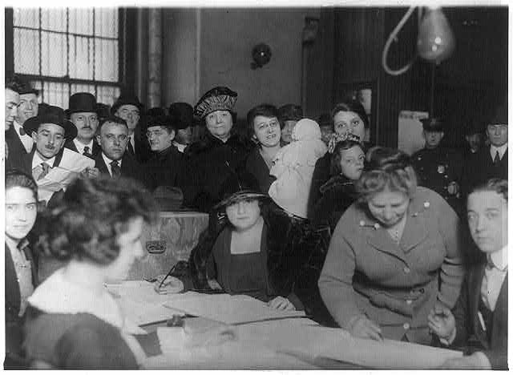

## The Progressive Era 1900-1917

In the last quarter of the nineteenth century, the United States transformed from a rural farming society into an urban industrial society. By 1900 the United States had replaced Great Britain as the leading industrial producer in the world. However, many Americans were concerned about worsening social conditions brought about by industrialization and urbanization. Labor strife continued. Abuses of child labor were widespread. Living and working conditions deteriorated in the cities.

At the same time, the wealth that was generated by the new industrial economy became more concentrated in a small number of families. This concentration of economic power helped cause a serious depression in 1907. Political institutions that had been suitable for a nation of farmers and small-business people could not deal with the problems of a large-scale industrial society. The developing economic, social, and political crises led to a time known as the Progressive Era. Progressive refers to a time of moving forward. This period lasted roughly from 1900 to 1917, when the United States entered World War I.

Industrialization had created a large new class of industrial workers. It also created a large urban middle class and a very small class of wealthy industrialists and financiers. Each of these groups had its own ideas about how the country should make reforms, or changes, to improve society and remove abuses. Many in the middle class felt that large corporations were destroying America's free-enterprise system. This system relied on free and open competition among companies.

Radical journalists, called muckrakers, exposed corruption in  business and politics and influenced many people. For example, in his books and articles, Lincoln Steffens exposed the corruption, poverty, and boss-run political systems in the large cities.

The growing strength of radicals and the influence of the middle class forced the Democratic and Republican parties to take reform seriously. At first, reforms were carried out at state and local levels. Local reforms included sanitation laws, building codes, and child welfare laws. But local financial resources were limited. Reformers wanted the federal government to help solve the most serious problems.

Society was deeply divided over what to do. Some people supported an idea called Social Darwinism. Its main belief is that society is based on the survival of the fittest. To them, wealth was a symbol of survival. Nature intended for some people to succeed and others to fail. Social Darwinists did not want government to take part in social reforms.

Others believed that reforms were necessary to keep the system from falling into economic disorder. Their spokesperson was President Theodore Roosevelt. He pushed for reforms to control the worst abuses of big business. The Progressive Era produced a long list of legislative reforms. Some of these included the regulation of railroads, the establishment of the Federal Trade Commission, and child labor laws.

## World War I

In 1914, Archduke Francis Ferdinand, the heir to the Austro-Hungarian throne, was assassinated. This sparked a war between rival groups of European nations-the Allies and the Central Powers. The United States stayed out of the war until 1917. Then Germany stepped up its submarine attacks on US passenger and merchant ships. The United States was forced into the war on the side of the Allies.

| Allies | Central Powers |
|:-|:-|
| Great Britain | Germany |
| France | Austria-Hungry |
| Russia | Ottoman Empire |
| Italy | (Turkey) |
| United States | - |
| Japan | - |
{: .striped .responsive-table }

By the time the United States entered the war, the warring countries were tired of fighting and neither side seemed able to win. US soldiers helped break this stalemate. On November 11, 1918, the Germans signed an armistice, or truce. Today we celebrate that date as Veterans Day.

World War I made the United States a major world power. President Woodrow Wilson proposed Fourteen Points to make a lasting peace, including free trade and open diplomacy (negotiations between nations). He also proposed the League of Nations, an international organization to help nations settle disputes. However, the other Allied leaders decided that the enemy, especially the Germans, needed to be taught a lesson. Despite Wilson's efforts, the peace treaties were harsh.

Republican leaders in the US Senate opposed Wilson's peace plans. They kept the United States from signing the peace treaties and joining the League of Nations. They feared that joining the League of Nations would force the United States to go to war if conflicts arose. The country retreated into isolationism, a policy of not participating in international relations. It stayed there until forced into war again in 1941.

## The Roaring Twenties

Isolationism meant that world affairs were quiet for the United States in the 1920s. At home, though, a lot was happening. President Calvin Coolidge said that "the chief business of the American people is business." That certainly seemed true. Giant companies developed and expanded modern forms of production and marketing. Mass-production assembly lines produced more goods at lower prices. Americans bought telephones, radios, and automobiles.

Chain stores and department stores replaced small shops. Industrial production rose 64 percent between 1919 and 1923. Many workers' real wages (that is, wages adjusted for inflation) rose 24 percent. Stock dividends often increased by 100 percent. Expanding industry brought more women into the work force. The Nineteenth Amendment (1920) gave women the right to vote.

{: .responsive-img .materialboxed}

[http://www.loc.gov/pictures/item/2002695608/](http://www.loc.gov/pictures/item/2002695608/){: target="_blank"}

African-American workers continued to migrate from the South to work in factories in the North. They could earn higher wages in the North. The neighborhood of Harlem in New York City became home to thousands of African-Americans. This new community gave rise to the Harlem Renaissance, a period of great artistic and cultural achievement. Harlem Renaissance poets, writers, and jazz and swing musicians and singers became world-famous.

## The Great Depression

The era of economic prosperity ended suddenly with the stock market crash of 1929. Manufacturers could not sell their goods. Farmers lost their farms. Unemployment in some cities rose to 60 percent. People without jobs faced losing their homes. When the Depression began, the United States had no unemployment insurance. It had little public welfare and no Social Security. Private relief agencies had difficulty caring for so many people. Millions of people had no money, no work, and no hope.

World War I veterans marched on Washington, DC, to collect their bonuses. They were driven out by the army. Organizers formed councils for the unemployed to keep people from being evicted from their homes.

The country was on the verge of economic collapse. Franklin D. Roosevelt was elected president in 1932. Roosevelt's New Deal programs included Social Security and Federal Unemployment Insurance. These programs were designed to prevent the worst features of the Great Depression from taking place again. The Works Progress Administration (WPA) gave public works jobs to thousands of unemployed people.

The New Deal did not get the United States out of the Depression. It did, though, establish the idea that government is responsible for helping people be free from economic anxiety. It did this through income support programs and the creation of jobs. At the same time, New Deal programs greatly increased the government's role in regulating the economy.

Labor unions made great gains during the Depression. New Deal laws guaranteed workers the right of collective bargaining, or the right to negotiate with their employers. The Congress of Industrial Organizations (CIO), formed in 1935, unionized four million industrial workers between 1935 and 1937. The older craft-oriented American Federation of Labor (APL) had paid little attention to industrial workers.