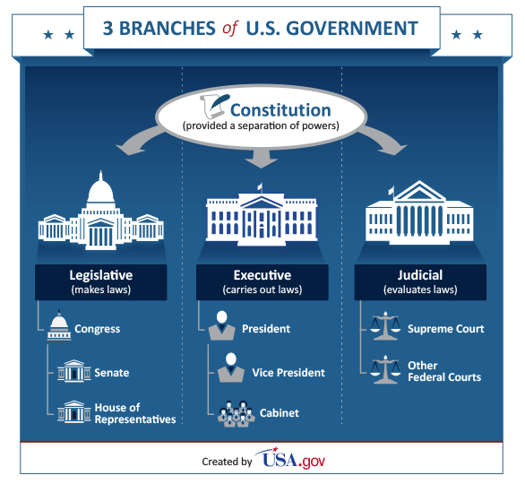

## The Federal Government

To prevent an imbalance (lack of equality) of power, the Constitution divided the power and functions of government among three branches: executive, legislative, and judicial. The Constitution also instituted a system of checks and balances. This would keep one branch of government from controlling any other branch.

This graphic shows the branches of US government.

{: .responsive-img .materialboxed }

[https://www.usa.gov/branches-of-government](https://www.usa.gov/branches-of-government)

### The Executive Branch

The executive branch oversees the day-to-day activities of the government. The president, who is the head of this branch, must be at least 35 years old and a natural-born citizen of the United States. The presidential term is four years. The Twenty-Second Amendment (1951) limits a person to ten years in office. If the president dies or resigns while in office, the vice president becomes president.

The executive branch includes all federal agencies, such as the Environmental Protection Agency (EPA). With Senate approval, the president appoints cabinet officers, who are called secretaries. These secretaries head the major government agencies. The president also appoints the major executive positions.

The executive branch enforces acts of Congress, court decisions, and treaties. The president can also issue proclamations (formal public statements) and executive orders. These powers have been delegated, or assigned, to the president by law or by court decision.

All bills passed by Congress must be sent to the president. If the president signs the bill, it becomes law. However, the president can refuse to sign the bill and return it to Congress. This action is called a veto. Congress may override the president's veto by a two-thirds vote of both houses of Congress. However, if the president does not return the bill within ten days, the bill automatically becomes a law, unless Congress adjourns during that period. A pocket veto occurs if Congress adjourns during that 10-day period and the president does not sign the bill.  Congress cannot override this kind of veto. The president's veto power shows how the executive branch checks the legislative branch. However, the legislative branch also has a check over the executive branch.

### The Legislative Branch

The legislative branch of the federal government is called the Congress. It is responsible for writing the laws of the country. Congress is made up of two houses: the Senate and the House of Representatives. The Senate is made up of two senators from each of the 50 states, making 100 members. The House of Representatives has 435 members, a number that Congress has limited since 1910. The number of representatives from a state is determined by the population of the state.

A senator is elected for six years, must be at least 30 years old, and must have been a US citizen for nine years. A representative in the House is elected for two years, must be at least 25 years of age, and must have been a US citizen for seven years.

#### Powers

Congress is responsible for taxing people. Taxes are used to provide services to people, to defend the country, and to pay the government's debts. Congress has the power to coin money, to declare war, and to override a presidential veto with a two-thirds vote of both houses. Congress proposes amendments to the Constitution, has the power of impeachment, and organizes the federal court system.

Congress operates as a check on the executive branch. It defines the functions, or roles, of the departments in the executive branch and controls the money set aside for those departments. Congress has the power to investigate many areas inside and outside of the government, including the executive branch. A congressional committee, like the court system, has the power to subpoena witnesses, or issue a formal command that requires a person to testify. Congress can exert a great deal of influence when it assumes a "watchdog" role over the executive branch.

#### Organization

The vice president presides over the Senate but has little real power to direct the workings of the Senate. The vice president can cast a vote only to break a tie. The party that has the majority of delegates in the Senate elects a Senate Majority Leader, who leads the legislative activity in the Senate. The Speaker of the House is elected by the majority party in the House of Representatives. The Speaker presides over the meetings of the House and is responsible for organizing its activities.

Both houses of Congress are organized into committees to carry out the tasks of researching, holding hearings, and writing legislation. All legislation must go through a committee before it can be considered for a vote. Two important committees are the House Ways and Means Committee, which considers revenue (tax) bills, and the Senate Committee on Foreign Relations, which reviews all treaties.

### The Judicial Branch

The judicial branch of the federal government interprets laws. It is the federal court system's responsibility to hear cases involving federal law.

The Supreme Court in Washington, DC, heads the federal courts. It consists of a chief justice and eight associate justices. The president appoints these justices with the Senate's approval. The justices serve for life, but they can be impeached for misconduct. The major functions of the Supreme Court are to hear appeals of lower federal-court decisions and to hear cases from state courts about whether a law is constitutional.

Prior to the second half of the twentieth century, all the justices were white men. In 1967 President Lyndon B. Johnson appointed his friend, Thurgood Marshall, to the court. Marshall became the first African American justice. President Ronald Reagan appointed Sandra Day O'Connor, the first woman on the Court, in 1981. She retired after serving nearly 25 years. Ruth Bader Ginsburg joined her as the second female associate justice in 1993. In 2009, Sonia Sotomayor became the first Hispanic American to serve on the Court.

Below the Supreme Court are the federal circuit courts of appeals. They hear appeals and review decisions of the federal district court and federal administrative bodies. At the lowest level are the federal district trial courts. The president appoints all federal judges.

The single most important power of the Supreme Court is its power of judicial review. This means that the Supreme Court rules on the constitutionality of laws passed by the legislative branch or on actions taken by the executive branch. The power of judicial review was first used by the Supreme Court in 1803 in Marbury v. Madison. In that case, the court refused to enforce a law that it believed was unconstitutional. The judicial branch has become an equal partner in the three-way separation of powers in the federal government.

<video controls><source src="https://static.flocabulary.com/media/streaming/20e0a352aaca4b45b019458b35ac759b/360/SOC-3-branches-of-government.mp4" type="video/mp4"></video>
{: .responsive-video }

[https://www.flocabulary.com/3-branches-of-government/](https://www.flocabulary.com/3-branches-of-government/){: target="_blank" }
