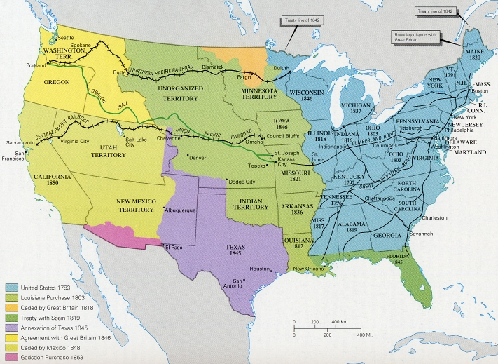

## The American Revolution

In 1763, England passed several laws that resulted in new taxes for the American colonists. Among the laws were the Sugar Act, the Stamp Act, and the Tea Act. These laws angered colonists. They had no political representation in England, where the laws were passed. The colonists protested these laws by dumping tea into Boston Harbor on December 16, 1773. This event is known as the Boston Tea Party.

The English responded with the Intolerable Acts. Boston Harbor was dosed until the colonists paid for the destroyed tea. In addition, colonists were forced to pay for housing English soldiers.

In response, the colonists called for a meeting of the First Continental Congress. The delegates met in 1774 to draw up a document that stated their loyalty to the king of England but also outlined their rights. They formed a plan to boycott, or refuse to buy, British goods.

In April 1775, British troops and American colonists fought in Massachusetts at Lexington and Concord. The battles marked the beginning of the American Revolution. A revolution is the overthrow of a government or ruler and replacement with another government.

The Second Continental Congress met later in 1775. It voted to establish an army, and it named George Washington as commander in chief. In July 1776, the Second Continental Congress adopted the Declaration of Independence. The Declaration established the principle that government must be based on the consent, or agreement, of the governed.

The colonists waged a five-year war with England. It ended in 1781 with the surrender of the British at Yorktown, Virginia. The Americans had won their independence; they were no longer under the control of the British government.

The American Revolution marked the first time that a European power had lost a colony to an independent movement. This influenced the successful slave revolution against the French in Haiti (1795-1803) and later struggles against Spanish rule in Latin America in the early nineteenth century.

## Creating the Constitution

The years after the Revolutionary War (1783- 1789) were troubled times. The nation was in a serious economic depression. The Articles of Confederation were adopted in 1781. They established a weak national government with no executive branch or court system. The government had no power to tax or to regulate commerce between the states. Interstate commerce was difficult because each state could issue its own currency (the bills and coins used in trade) and often charged its own taxes on goods.

Meetings held in some states in 1785 and 1786 led to a call for a Constitutional Convention. The convention opened in Philadelphia in May 1787.

One of the main issues was the division of power between the central government and the states. The final Constitution, the document that defined the basic laws and principles of government for the United States, represented a compromise between centralized power and states' rights. The government in Washington increased its powers. It gained the right to tax, create an army and navy, control foreign trade, make treaties,  and control currency. The states, however, still maintained important responsibilities. The kind of arrangement that divides power between a central government and the states is called a federal system.

Another compromise was reached over the issue of whether enslaved people should be counted in population totals. If they were, Southern states would have greater representation in the House of Representatives. Southern delegates argued that slaves should be count ed. Northern delegates said that if enslaved people were counted for representation, they should be counted for taxation.

The Three-Fifths Compromise agreed that only three-fifths of all enslaved people would be counted in population totals. This gave slave states more power in the House of Representatives. The Constitution also protected the slave trade for at least 20 years.

## The Louisiana Purchase

The new nation had gained from England most of the land east of the Mississippi River. In 1800, Spain gave France most of the Louisiana Territory. This gave France control over the Mississippi River. In 1803, President Thomas Jefferson bough t the huge Louisiana Territory for $15 million. The purchase doubled the size of the United States. It also put the Mississippi River firmly under US control.

## The War of 1812

The War of 1812 was fought over English interference with US merchant ships. The war ended with no clear winner. However, the War of 1812 was important for the United States for two reasons. First, it united Americans by temporarily making national interests more important than sectional, or local, interest s. Second, it proved that the United States had a strong military. With new land open in the West and the removal of the English threat , there was opportunity to expand US territory.

## Westward Expansion

Expansion means "increase" or "enlargement." From 1800 to 1850, Americans believed that it was their destiny, or fate, to occupy the land from the Atlantic Ocean to the Pacific Ocean. This belief, and the policies that developed from it, came to be called Manifest Destiny. The United States soon obtained Florida from Spain and Texas from Mexico.

The Mexican government gave grants of land in its province of Texas to American settlers during the 1820s. Later these settlers revolted against Mexico. They declared Texas an independent republic in 1836. The brief but fierce war was famous for the battle of the Alamo in San Antonio.

In 1845, the United States annexed, or added on, Texas as a state. This angered many Mexicans. When US troops occupied a border region claimed by Mexico, the Mexican War began. The United States won the war. It took control of an area that now makes up the states of California, Nevada, Utah, Arizona, New Mexico, Texas, and parts of Oklahoma, Kansas, Colorado, and Wyoming. The United States also acquired the Oregon Territory from England.

{: .responsive-img .materialboxed }

[http://www.learner.org/](http://www.learner.org/)

### Economic Development

Economic growth was rapid during the early 1800s. This period is called the Industrial Revolution. The building of canals and the development of the steamboat created a big increase in transportation by water. That, in tum, resulted in an increase in trade. After the 1820s, building railroads became a major economic activity. By 1860, the United States was crisscrossed with about 30,000 miles of railroad tracks.

The cotton industry brought in more money than all other exports (goods sent to another country) combined. This cotton boom began with Eli Whitney's invention of the cotton gin in the 1790s. The cotton gin could clean the large amounts of cotton that were needed for manufacturing. The Industrial Revolution led to the establishment of large mechanized mills in England and New England where cotton was processed. The demand for Southern cotton grew. In this way, cotton helped firmly establish slave labor as the basis for the South's economy.

Issues about democratic rights became important during Andrew Jackson's presidency (1829-1837). Previously most states had required people to be property owners in order to vote. Now this requirement was dropped. All white male citizens over the age of 21 could vote. However, Native Americans, women, and African-Americans still could not vote.

More Americans wanted to abolish, or get rid of, slavery. These people helped create an antislavery movement in the North and West. This resulted in popular support for the Union position in the Civil War.

Women continued to have few rights, but they were active in early antislavery societies. The experience of fighting for the rights of  enslaved persons helped women fight for their own rights. Women's suffrage, or the right of women to vote, because a major cause. In 1848, Elizabeth Cady Stanton and Lucretia Mott founded the first national women's organization at Seneca Falls, New York. Its goal was equal rights for women.

The growth of the United States and the development of regional economies created political problems. The Southern economy was based on slavery and the export of cotton. The Western economy was based on crops grown on small farms. The North, especially the Northeast, became the region of shipping, finance, and industry. These differences led to the growth of sectional identification. Politicians in each region defended their region's economic interests. Sectionalism was an important cause of the Civil War.
